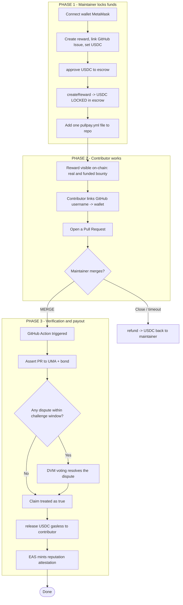
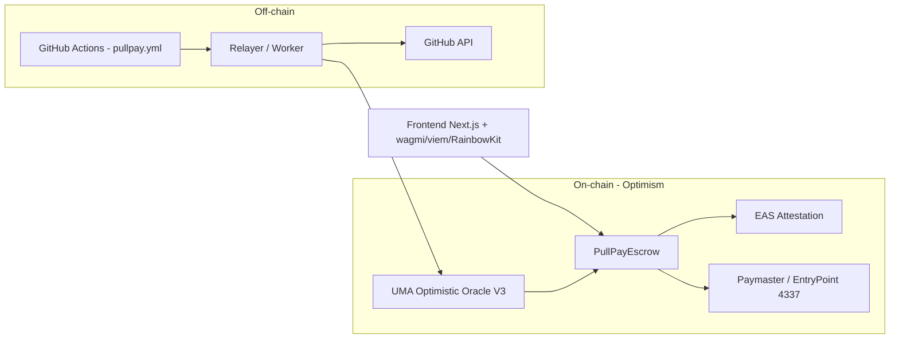
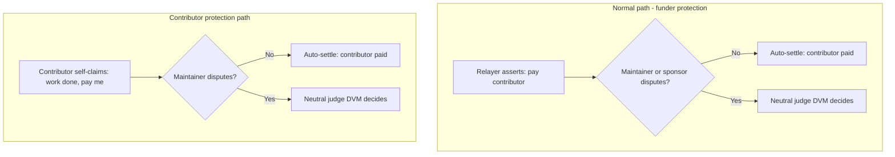
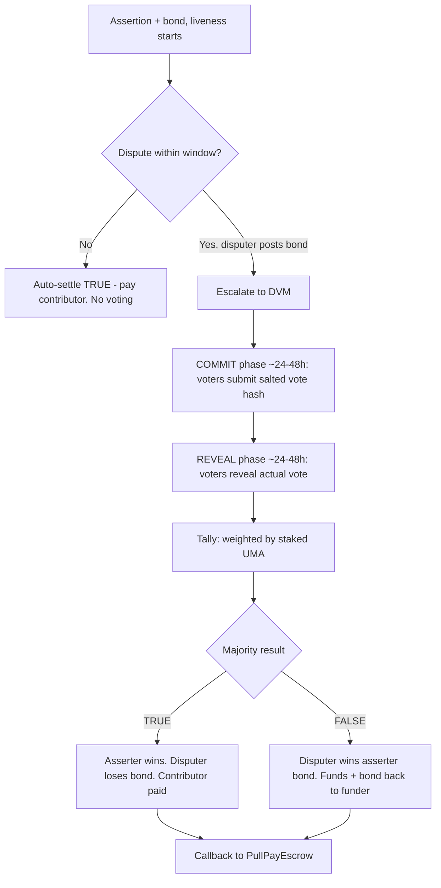
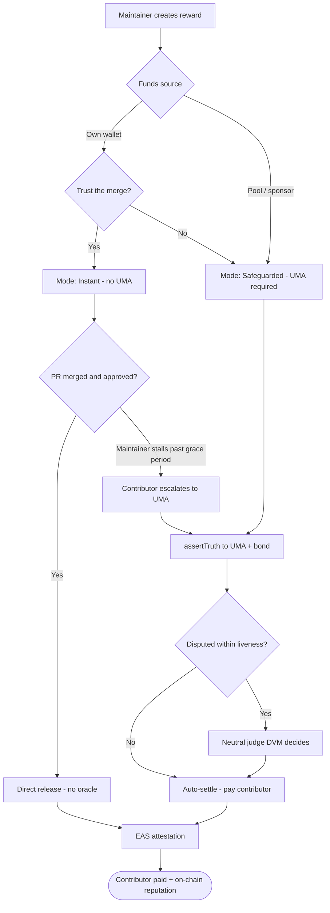
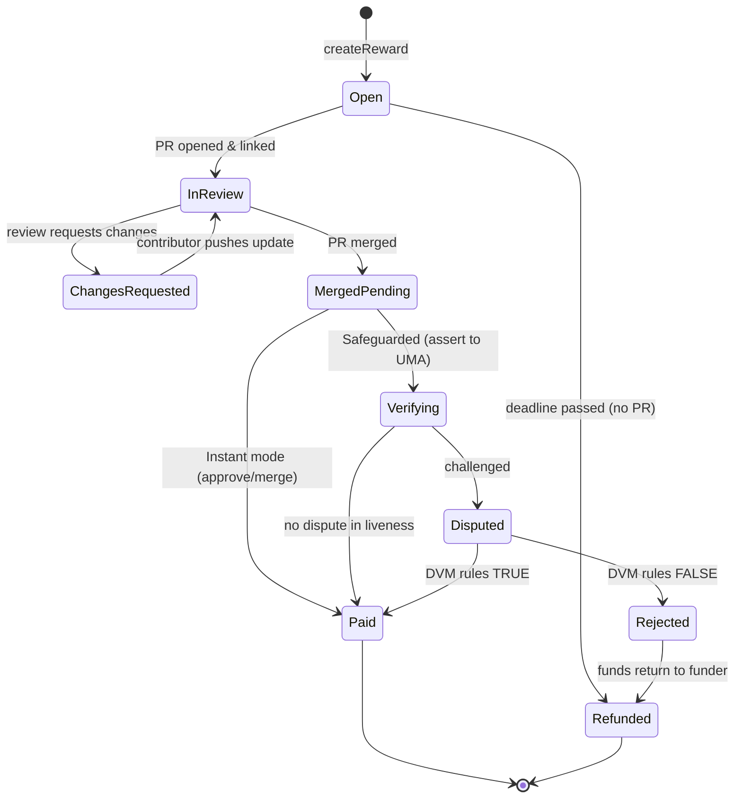
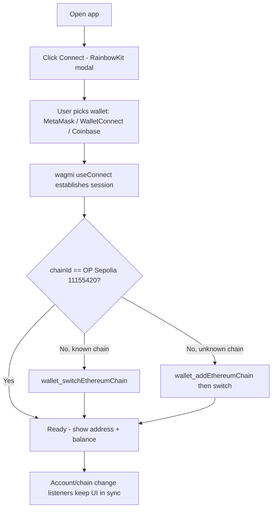
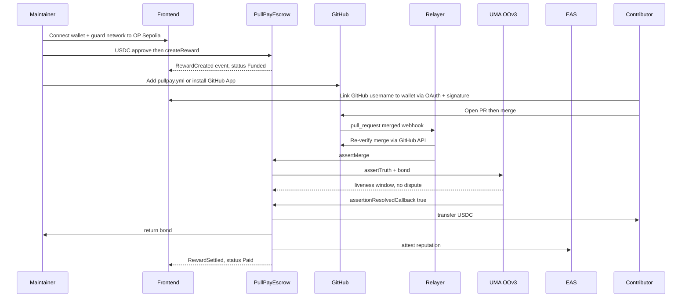

# PullPay x Optimism — Full PRD (v1.0)

<aside>
📌

**Status:** Draft v1.0 · **Owner:** Irham Tri Ahmadi · **Target:** Hackathon (Optimism) · **Related:** short planning page (previous).

</aside>

<aside>
🎯

**One-liner:** Merge the PR, the contributor gets paid in USDC — verified without an intermediary (UMA), settled without gas (AA), and recorded as on-chain reputation (EAS). Trust-minimized open source rewards, on Optimism.

</aside>

## 1. Executive Summary

PullPay is **open source reward infrastructure** on Optimism. A maintainer locks USDC in an on-chain escrow and adds a single workflow file to the repo. When a Pull Request (PR) is merged and its **eligibility is verified in a decentralized way**, USDC is automatically paid to the contributor — without the contributor needing any ETH — and a reputation attestation is minted on-chain.

Unlike competitors that only check `merged == true` via a centralized server, PullPay answers a sharper question: **"is this PR actually worth paying for?"** through the UMA Optimistic Oracle.

## 2. Background & Problem

The open source ecosystem runs on hundreds of small contributions (bug fixes, docs, translations, tooling). But paying a $5–20 reward is surprisingly hard:

- **Fees eat the reward:** Stripe ~2.9% + $0.30 (36% erosion on $5); bank wire $15–$45; Ethereum L1 gas $15+.
- **Manual overhead:** payouts are coordinated over Discord, spreadsheets, DMs, and collecting wallet addresses — costing more than the reward itself.
- **Trust gap:** contributors don't know if a bounty is truly funded; maintainers have no quality guarantee.
- **Weakness of existing crypto solutions:** they all depend on a **centralized bot/server** and only check merge status — manipulable and blind to quality.

## 3. Goals & Non-Goals

### Goals

- Automate reward payout when a PR is merged & verified, end-to-end.
- **Decentralized** verification (not a single server) with a dispute mechanism.
- **Zero setup** for maintainers (1 workflow file) & **gasless** for contributors.
- Build **portable on-chain contributor reputation**.
- Settlement cost < 1% of the reward value.

### Non-Goals

- Not a centralized paid bounty marketplace.
- No contributor KYC/tax handling (out of MVP scope).
- No support (for MVP) beyond GitHub, or beyond USDC.
- Not an automated code-quality judge (quality is judged via human dispute).

## 4. Target Users & Personas

| Persona | Need | Value from PullPay |
| --- | --- | --- |
| **OSS Maintainer** | Reward small contributions without payout hassle | Lock funds once, the rest is automatic |
| **Contributor** | Get paid fast, without crypto friction | USDC arrives automatically, no ETH needed |
| **Sponsor/Ecosystem** | Fund repos & see real impact | Transparent pool + reputation/attestations |
| **Disputer/Verifier** | Incentive to keep the system honest | Bond reward from winning a dispute |

## 5. Competitive Landscape & Differentiation

| Project | Chain | Verification | Limitation |
| --- | --- | --- | --- |
| Octasol | Solana | Centralized bot | Checks merge only |
| [Collaborators.build](http://Collaborators.build) | On-chain USDC | Centralized bot | Checks merge only |
| [boss.dev](http://boss.dev), Opire, Gitpay | Web2/mixed | Centralized | Not trust-minimized |
| [tea.xyz](http://tea.xyz) | OP Stack L2 | Proof of Contribution | Package-focused, not PR-level |
| PullPay (Stellar, reference) | Stellar | Centralized Cloudflare Worker | Centralized oracle |

**PullPay x Optimism differentiation:**

1. **Decentralized verification + dispute layer (UMA)** — moving from "is it merged?" to "is it worth paying?".
2. **On-chain reputation (EAS)** — portable, verifiable developer CV.
3. **Gasless (ERC-4337)** — frictionless onboarding for non-crypto developers.
4. **Multi-contributor auto-split** (roadmap) — the unsolved co-author problem.

## 6. Key Features (Product Overview)

- **F1 — Create & Fund Reward:** maintainer locks USDC into escrow, links to a GitHub Issue.
- **F2 — Zero-setup Workflow:** a `pullpay.yml` file triggers the process when a PR is merged.
- **F3 — Decentralized Verification:** assert "PR is eligible" to UMA + challenge window.
- **F4 — Dispute Resolution:** anyone can challenge; resolved via UMA voting.
- **F5 — Auto Payout (Gasless):** contract releases USDC to the contributor; gas sponsored by a paymaster.
- **F6 — Reputation Attestation:** EAS mints proof of contribution on-chain.
- **F7 — Refund:** funds return to the maintainer if the PR is never merged / a dispute wins.
- **F8 — Dashboard:** reward status, history, reputation.

## 7. User Flow



## 8. Functional Requirements (per component)

### 8.1 Escrow Contract

- FR-1: Maintainer can create a reward bound to a unique `rewardId` + metadata (repo, issue, amount, token, mode).
- FR-2: Funds are pulled via `approve` + `transferFrom` and locked until settle/refund.
- FR-3: Only the verification module (UMA callback) can trigger `release`.
- FR-4: `release` pays the contributor, marks the reward `settled`, prevents double-spend.
- FR-5: `refund` returns funds to the maintainer after the deadline / a won dispute.
- FR-6: Per-reward isolation (a relayer/oracle cannot drain the escrow).

### 8.2 Verification (UMA)

- FR-7: On merge, the system `assertTruth`s a structured statement (see §11).
- FR-8: Bond & liveness (challenge window) are configurable.
- FR-9: If not disputed → auto-settle → callback to escrow.
- FR-10: If disputed → escalate to DVM voting → result triggers release/refund.

### 8.3 GitHub Automation

- FR-11: `pullpay.yml` triggers on `pull_request` (closed + merged).
- FR-12: The Action sends a payload (repo, PR#, issue#, author) to the relayer.
- FR-13: The relayer re-verifies the merge via the GitHub API before asserting.

### 8.4 Reputation (EAS)

- FR-14: On settle, create an attestation containing {repo, contribution type, amount, date, contributor}.
- FR-15: Attestations can be queried to build a public profile.

### 8.5 Gasless (AA)

- FR-16: Contributor claims/receives without holding ETH (paymaster sponsors gas).

## 9. System Architecture



**Components:**

- **PullPayEscrow** — the core: stores rewards, triggers release/refund.
- **UMA OOv3** — verification & dispute layer.
- **EAS** — reputation recorder.
- **EntryPoint + Paymaster (ERC-4337)** — gasless transactions.
- **Relayer/Worker** — assertion proposer (verifies merge then asserts to UMA).
- **GitHub Actions** — event trigger.
- **Frontend** — create reward, dashboard, claim UI.

## 10. Data Model

**Reward (on-chain):**

| Field | Type | Description |
| --- | --- | --- |
| rewardId | bytes32 | Unique key (hash of repo+issue+nonce) |
| maintainer | address | Reward creator |
| token | address | USDC address |
| amount | uint256 | Reward amount |
| repo | string | "owner/repo" |
| issueNumber | uint256 | Issue number |
| mode | enum | Instant / Timelock |
| deadline | uint256 | Refund deadline |
| assertionId | bytes32 | UMA assertion ID |
| contributor | address | Recipient (set on verification) |
| status | enum | Funded / Asserted / Settled / Refunded |

## 11. Smart Contract Specification

### UMA assertion claim structure

> “PR #<pr> in repo <owner/repo> has been merged into the default branch AND resolves Issue #<issue> per the reward description <rewardId>. The rightful recipient is <contributor>.”
> 

### Core contract (concise)

```solidity
// SPDX-License-Identifier: MIT
pragma solidity ^0.8.24;

import "@openzeppelin/contracts/token/ERC20/IERC20.sol";
import "@openzeppelin/contracts/access/Ownable.sol";

interface IOptimisticOracleV3 {
    function assertTruth(
        bytes memory claim, address asserter, address callbackRecipient,
        address escalationManager, uint64 liveness, IERC20 currency,
        uint256 bond, bytes32 identifier, bytes32 domainId
    ) external returns (bytes32 assertionId);
}

contract PullPayEscrow is Ownable {
    enum Mode { Instant, Timelock }
    enum Status { None, Funded, Asserted, Settled, Refunded }

    struct Reward {
        address maintainer; address token; uint256 amount;
        string repo; uint256 issueNumber; Mode mode; uint256 deadline;
        bytes32 assertionId; address contributor; Status status;
    }

    IOptimisticOracleV3 public oo;
    address public relayer;
    mapping(bytes32 => Reward) public rewards;
    mapping(bytes32 => bytes32) public assertionToReward;

    event RewardCreated(bytes32 id, address maintainer, uint256 amount);
    event RewardAsserted(bytes32 id, bytes32 assertionId, address contributor);
    event RewardSettled(bytes32 id, address contributor, uint256 amount);
    event RewardRefunded(bytes32 id);

    modifier onlyRelayer() { require(msg.sender == relayer, "not relayer"); _; }

    constructor(address _oo, address _relayer) Ownable(msg.sender) {
        oo = IOptimisticOracleV3(_oo); relayer = _relayer;
    }

    function createReward(
        bytes32 id, address token, uint256 amount, string calldata repo,
        uint256 issueNumber, Mode mode, uint256 deadline
    ) external {
        require(rewards[id].status == Status.None, "exists");
        IERC20(token).transferFrom(msg.sender, address(this), amount);
        rewards[id] = Reward(msg.sender, token, amount, repo, issueNumber,
                             mode, deadline, bytes32(0), address(0), Status.Funded);
        emit RewardCreated(id, msg.sender, amount);
    }

    // Relayer triggers the UMA assertion after verifying the merge
    function assertMerge(bytes32 id, address contributor, bytes calldata claim,
                         uint64 liveness, IERC20 bondCurrency, uint256 bond)
        external onlyRelayer
    {
        Reward storage r = rewards[id];
        require(r.status == Status.Funded, "bad status");
        bondCurrency.transferFrom(msg.sender, address(this), bond);
        bondCurrency.approve(address(oo), bond);
        bytes32 aId = oo.assertTruth(claim, msg.sender, address(this), address(0),
            liveness, bondCurrency, bond, bytes32("ASSERT_TRUTH"), bytes32(0));
        r.assertionId = aId; r.contributor = contributor; r.status = Status.Asserted;
        assertionToReward[aId] = id;
        emit RewardAsserted(id, aId, contributor);
    }

    // Callback from UMA when the assertion resolves true
    function assertionResolvedCallback(bytes32 assertionId, bool truthfully) external {
        require(msg.sender == address(oo), "only oo");
        bytes32 id = assertionToReward[assertionId];
        Reward storage r = rewards[id];
        if (truthfully && r.status == Status.Asserted) {
            r.status = Status.Settled;
            IERC20(r.token).transfer(r.contributor, r.amount);
            emit RewardSettled(id, r.contributor, r.amount);
            // (hook) call EAS.attest(...) here
        } else {
            r.status = Status.Funded; // disputed & failed -> can be re-asserted / refunded
        }
    }

    function refund(bytes32 id) external {
        Reward storage r = rewards[id];
        require(msg.sender == r.maintainer, "not maintainer");
        require(r.status == Status.Funded && block.timestamp > r.deadline, "not refundable");
        r.status = Status.Refunded;
        IERC20(r.token).transfer(r.maintainer, r.amount);
        emit RewardRefunded(id);
    }
}
```

<aside>
⚠️

The `assertTruth`/callback signatures follow UMA OOv3 — match them to the official contracts (`dev-quickstart-oov3`) at implementation time.

</aside>

### Example `pullpay.yml`

```yaml
name: PullPay
on:
  pull_request:
    types: [closed]
jobs:
  settle:
    if: github.event.pull_request.merged == true
    runs-on: ubuntu-latest
    steps:
      - name: Notify PullPay relayer
        run: |
          curl -X POST https://relayer.pullpay.dev/settle \
            -H 'Content-Type: application/json' \
            -d '{
              "repo": "REPO_PLACEHOLDER",
              "pr": PR_NUMBER_PLACEHOLDER,
              "issue": ISSUE_NUMBER_PLACEHOLDER,
              "author": "AUTHOR_PLACEHOLDER"
            }'
```

### Frontend config (wagmi + RainbowKit + viem)

```tsx
import { getDefaultConfig } from '@rainbow-me/rainbowkit'
import { optimism, optimismSepolia } from 'viem/chains'

export const config = getDefaultConfig({
  appName: 'PullPay',
  projectId: 'WALLETCONNECT_PROJECT_ID',
  chains: [optimismSepolia, optimism],
  ssr: true,
})
```

## 12. Full Tech Stack

| Layer | Technology | Notes |
| --- | --- | --- |
| **Blockchain** | Optimism (OP Mainnet) / Optimism Sepolia | EVM L2, cheap gas |
| **Smart contract** | Solidity ^0.8.24, OpenZeppelin | Escrow, access control |
| **Contract dev/test** | Foundry (forge, cast, anvil) | Test + deploy + fuzz |
| **Alternative tooling** | Hardhat + TypeChain | If the team prefers TS |
| **Asset** | USDC (ERC-20) | approve + transferFrom pattern |
| **Verification** | UMA Optimistic Oracle V3 | assertTruth + escalation manager |
| **Reputation** | Ethereum Attestation Service (EAS) | Contribution attestation schema |
| **Gasless** | ERC-4337 (EntryPoint, Bundler, Paymaster) | e.g. Pimlico / Alchemy AA / Biconomy |
| **Automation** | GitHub Actions (`pullpay.yml`) | PR event trigger |
| **Relayer/Backend** | Node.js/TypeScript + viem; Cloudflare Workers or serverless | Verify GitHub API, propose assertion |
| **GitHub integration** | GitHub REST/GraphQL API, Octokit | Verify merge, PR metadata |
| **Frontend framework** | Next.js 16 (App Router) + React 19 + TypeScript | Latest stable (16.2.x, React 19.2); scaffold `npx create-next-app@latest` |
| **Wallet & chain** | RainbowKit + wagmi v2 + viem + @tanstack/react-query | MetaMask & other wallets |
| **Styling/UI** | Tailwind CSS + shadcn/ui | Fast & clean |
| **Proof storage** | IPFS ([web3.storage](http://web3.storage) / Pinata) | Hash on-chain, file off-chain |
| **Indexing/data** | The Graph or Ponder | Query events for the dashboard |
| **RPC/infra** | Alchemy / Infura / QuickNode (Optimism) | Node endpoints |
| **Contributor auth** | GitHub OAuth (link username -> wallet) | Recipient mapping |
| **CI/CD & hosting** | GitHub Actions, Vercel (frontend), Fleek/Cloudflare | Deploy |
| **Monitoring** | Tenderly (contract), Sentry (frontend) | Observability |
| **Languages** | Solidity, TypeScript, YAML | — |

## 13. Security & Threat Model

| Threat | Mitigation |
| --- | --- |
| Self-merge / sybil (maintainer pays own alt) | Bond + UMA dispute; anyone can challenge |
| Malicious/compromised relayer | Contract isolates per-reward; relayer can only assert, not release directly; release only via UMA callback |
| `pullpay.yml` tampering | Relayer re-verifies via GitHub API; UMA as backstop |
| Reentrancy | Checks-Effects-Interactions + nonReentrant guard |
| Claim front-running | rewardId & contributor bound in the assertion |
| Fake proof | IPFS proof hash + challenge window |
| Relayer private key leak | Key rotation, limited allowance, least privilege |

## 14. Economics & Gas

- Contract interactions on Optimism are typically a few cents; an ERC-20 transfer can be tiny when the network is idle.
- Fee = L2 execution (cheap) + L1 data fee (variable; dropped sharply post EIP-4844/blobs).
- Erosion < 1% on $5–20 rewards — far below Stripe (36% on $5) or Ethereum L1 ($15+).
- **Optional revenue:** small protocol fee / escrow yield (Aave) — out of MVP scope.

## 15. Success Metrics (KPIs)

- Number of rewards created & settled.
- USDC value distributed.
- Average merge → payout time.
- Dispute rate (low target = healthy optimistic system).
- Number of reputation attestations minted.
- Number of newly funded Optimism wallets (ecosystem impact).

## 16. MVP Scope vs Roadmap

### MVP (hackathon, 2–3 days)

- [ ]  `PullPayEscrow`: createReward / assertMerge / callback / refund
- [ ]  UMA OOv3 integration (short liveness 30–120s or sandbox oracle)
- [ ]  `pullpay.yml` + minimal relayer (verify GitHub API -> assert)
- [ ]  Frontend: create reward (approve) + status dashboard
- [ ]  1 EAS attestation on settle (simple)
- [ ]  Deploy to Optimism Sepolia
- [ ]  End-to-end demo: create -> PR -> merge -> (window) -> USDC arrives -> attestation

### Roadmap

- Full gasless (production paymaster)
- Multi-contributor auto-split (co-author trailer)
- 24h Timelock mode + dispute UI
- RetroPGF-style per-repo pool
- Escrow yield (Aave)
- GitLab/Gitea support; multi-token

## 17. Hackathon Timeline (indicative)

| Day | Focus |
| --- | --- |
| Day 0 (evening) | Setup repo, Foundry, scaffold frontend (RainbowKit), deploy mock USDC |
| Day 1 | Escrow contract + tests; UMA integration (assert + callback) |
| Day 2 | Relayer + `pullpay.yml`; frontend create reward + dashboard; EAS attestation |
| Day 3 | Polish demo, deploy Sepolia, record demo, pitch slides |

## 18. Risks & Mitigations

| Risk | Mitigation |
| --- | --- |
| Idea is crowded | Differentiate via UMA + EAS + gasless |
| UMA resolution too slow for a demo | Short liveness / sandbox oracle |
| Scope overrun | Lock one end-to-end flow; the rest is roadmap |
| AA (4337) complexity | MVP can mock gasless; paymaster on roadmap |
| EAS integration eats time | Ship a minimal attestation first |

## 19. Resolved Design Decisions

These resolve the previously open questions.

### 19.1 Who pays the assertion bond?

**Decision:** the **maintainer posts the bond bundled at `createReward`** (a small amount on top of the reward, e.g. in USDC). If the assertion settles honestly (undisputed), the bond is returned to the maintainer. If a dispute proves the claim false, the bond compensates the honest disputer per UMA rules. Rationale: keeps the relayer capital-free and stateless, and aligns incentives (the party funding the reward also backs its correctness).

- *Alternative (roadmap):* protocol treasury fronts the bond, recovered via a small protocol fee.

### 19.2 Objective definition of “worth paying”

**Decision:** eligibility is defined **per reward** by the maintainer at creation and encoded into the assertion claim. The claim binds three objective, checkable facts plus one criteria reference:

1. PR merged into the default branch (GitHub API verifiable).
2. PR closes/links the specified Issue #.
3. Recipient = the PR author (or the mapped wallet).
4. Work matches the **acceptance criteria URI** (a link/hash stored in reward metadata, e.g. the Issue body or an IPFS spec).

Disputers judge against that fixed criteria reference, so voting is anchored to a pre-agreed spec rather than subjective taste.

### 19.3 Multi-author PRs (MVP)

**Decision:** MVP pays a **single recipient** (the PR author). Co-author splitting is roadmap. To avoid locked funds, the data model already stores `contributor` as a settable field so a splitter module can be added later without a storage migration.

### 19.4 Contributor never connects a wallet

**Decision:** funds are **never stuck**. If no recipient wallet is mapped by the reward `deadline`, the maintainer can call `refund`. Contributors map GitHub username → wallet via GitHub OAuth before settlement; unmapped rewards simply time out to refund.

## 20. Fully Integrated Contract (UMA + EAS + Bond + Guards)

This extends §11 with real UMA callbacks, EAS attestation on settle, bundled bond, reentrancy protection, and per-reward isolation.

```solidity
// SPDX-License-Identifier: MIT
pragma solidity ^0.8.24;

import "@openzeppelin/contracts/token/ERC20/IERC20.sol";
import "@openzeppelin/contracts/token/ERC20/utils/SafeERC20.sol";
import "@openzeppelin/contracts/utils/ReentrancyGuard.sol";
import "@openzeppelin/contracts/access/Ownable.sol";

/* ---------- UMA Optimistic Oracle V3 (minimal interface) ---------- */
interface IOptimisticOracleV3 {
    function assertTruth(
        bytes memory claim,
        address asserter,
        address callbackRecipient,
        address escalationManager,
        uint64 liveness,
        IERC20 currency,
        uint256 bond,
        bytes32 identifier,
        bytes32 domainId
    ) external returns (bytes32 assertionId);

    function settleAndGetAssertionResult(bytes32 assertionId) external returns (bool);
    function defaultIdentifier() external view returns (bytes32);
}

/* ---------- EAS (minimal interface) ---------- */
struct AttestationRequestData {
    address recipient;
    uint64 expirationTime;
    bool revocable;
    bytes32 refUID;
    bytes data;
    uint256 value;
}
struct AttestationRequest {
    bytes32 schema;
    AttestationRequestData data;
}
interface IEAS {
    function attest(AttestationRequest calldata request) external payable returns (bytes32);
}

contract PullPayEscrow is Ownable, ReentrancyGuard {
    using SafeERC20 for IERC20;

    enum Mode { Instant, Timelock }
    enum Status { None, Funded, Asserted, Settled, Refunded, Rejected }

    struct Reward {
        address maintainer;
        address token;      // reward token (USDC)
        uint256 amount;     // reward amount
        uint256 bond;       // bond bundled by maintainer (same token for simplicity)
        string  repo;
        uint256 issueNumber;
        bytes32 criteriaHash; // hash/URI ref of acceptance criteria
        Mode    mode;
        uint256 deadline;
        bytes32 assertionId;
        address contributor;
        Status  status;
    }

    IOptimisticOracleV3 public immutable oo;
    IEAS public immutable eas;
    bytes32 public immutable easSchema;   // pre-registered EAS schema UID
    IERC20  public immutable bondCurrency; // e.g. USDC used for bonds
    address public relayer;
    uint64  public liveness = 7200;        // default challenge window (2h); short for demo

    mapping(bytes32 => Reward) public rewards;
    mapping(bytes32 => bytes32) public assertionToReward;

    event RewardCreated(bytes32 indexed id, address indexed maintainer, uint256 amount);
    event RewardAsserted(bytes32 indexed id, bytes32 indexed assertionId, address contributor);
    event RewardSettled(bytes32 indexed id, address indexed contributor, uint256 amount, bytes32 attestationUID);
    event RewardRejected(bytes32 indexed id);
    event RewardRefunded(bytes32 indexed id);

    modifier onlyRelayer() { require(msg.sender == relayer, "not relayer"); _; }

    constructor(
        address _oo, address _eas, bytes32 _easSchema,
        address _bondCurrency, address _relayer
    ) Ownable(msg.sender) {
        oo = IOptimisticOracleV3(_oo);
        eas = IEAS(_eas);
        easSchema = _easSchema;
        bondCurrency = IERC20(_bondCurrency);
        relayer = _relayer;
    }

    function setRelayer(address _relayer) external onlyOwner { relayer = _relayer; }
    function setLiveness(uint64 _liveness) external onlyOwner { liveness = _liveness; }

    /* ---------- 1) Maintainer funds reward + bond ---------- */
    function createReward(
        bytes32 id, address token, uint256 amount, uint256 bond,
        string calldata repo, uint256 issueNumber, bytes32 criteriaHash,
        Mode mode, uint256 deadline
    ) external nonReentrant {
        require(rewards[id].status == Status.None, "exists");
        require(amount > 0, "zero amount");
        IERC20(token).safeTransferFrom(msg.sender, address(this), amount);
        // bond bundled in bondCurrency (USDC); may differ from reward token
        if (bond > 0) bondCurrency.safeTransferFrom(msg.sender, address(this), bond);
        rewards[id] = Reward({
            maintainer: msg.sender, token: token, amount: amount, bond: bond,
            repo: repo, issueNumber: issueNumber, criteriaHash: criteriaHash,
            mode: mode, deadline: deadline, assertionId: bytes32(0),
            contributor: address(0), status: Status.Funded
        });
        emit RewardCreated(id, msg.sender, amount);
    }

    /* ---------- 2) Relayer asserts eligibility to UMA ---------- */
    function assertMerge(bytes32 id, address contributor, bytes calldata claim)
        external onlyRelayer nonReentrant
    {
        Reward storage r = rewards[id];
        require(r.status == Status.Funded, "bad status");
        require(contributor != address(0), "no contributor");
        r.contributor = contributor;
        r.status = Status.Asserted;
        bondCurrency.forceApprove(address(oo), r.bond);
        bytes32 aId = oo.assertTruth(
            claim, msg.sender, address(this), address(0),
            liveness, bondCurrency, r.bond, oo.defaultIdentifier(), bytes32(0)
        );
        r.assertionId = aId;
        assertionToReward[aId] = id;
        emit RewardAsserted(id, aId, contributor);
    }

    /* ---------- 3) UMA callback on resolution ---------- */
    function assertionResolvedCallback(bytes32 assertionId, bool assertedTruthfully)
        external nonReentrant
    {
        require(msg.sender == address(oo), "only oo");
        bytes32 id = assertionToReward[assertionId];
        Reward storage r = rewards[id];
        require(r.status == Status.Asserted, "bad status");
        if (assertedTruthfully) {
            r.status = Status.Settled;
            // return bond to maintainer, pay reward to contributor
            if (r.bond > 0) bondCurrency.safeTransfer(r.maintainer, r.bond);
            IERC20(r.token).safeTransfer(r.contributor, r.amount);
            bytes32 uid = _attest(id, r);
            emit RewardSettled(id, r.contributor, r.amount, uid);
        } else {
            // disputed & proven false: reward + bond return to maintainer
            r.status = Status.Rejected;
            IERC20(r.token).safeTransfer(r.maintainer, r.amount);
            if (r.bond > 0) bondCurrency.safeTransfer(r.maintainer, r.bond);
            emit RewardRejected(id);
        }
    }

    // UMA calls this if the assertion is disputed (optional hook)
    function assertionDisputedCallback(bytes32 assertionId) external {
        require(msg.sender == address(oo), "only oo");
        // no-op: final outcome handled in assertionResolvedCallback
    }

    /* ---------- 4) EAS reputation attestation ---------- */
    function _attest(bytes32 id, Reward storage r) internal returns (bytes32) {
        bytes memory data = abi.encode(
            r.repo, r.issueNumber, r.amount, r.criteriaHash, block.timestamp
        );
        return eas.attest(AttestationRequest({
            schema: easSchema,
            data: AttestationRequestData({
                recipient: r.contributor,
                expirationTime: 0,
                revocable: false,
                refUID: id,
                data: data,
                value: 0
            })
        }));
    }

    /* ---------- 5) Refund after deadline if never settled ---------- */
    function refund(bytes32 id) external nonReentrant {
        Reward storage r = rewards[id];
        require(msg.sender == r.maintainer, "not maintainer");
        require(r.status == Status.Funded && block.timestamp > r.deadline, "not refundable");
        r.status = Status.Refunded;
        IERC20(r.token).safeTransfer(r.maintainer, r.amount);
        if (r.bond > 0) bondCurrency.safeTransfer(r.maintainer, r.bond);
        emit RewardRefunded(id);
    }
}
```

**Notes on the integrated version:**

- **Bond bundled at creation** (§19.1) and refunded to the maintainer on honest settle; on a proven-false dispute both reward and bond return to the maintainer.
- **EAS attestation** minted to the contributor on settle, referencing the reward `id` via `refUID` and the acceptance-criteria hash (§19.2).
- **`SafeERC20` + `ReentrancyGuard`** cover the token-transfer and reentrancy threats from §13.
- **`forceApprove`** avoids the non-zero-allowance ERC-20 pitfall for the bond.
- **Per-reward isolation**: every transfer references a single reward's `amount`/`bond`; the relayer can only `assertMerge`, never move funds directly.
- **EAS schema** must be pre-registered on Optimism (e.g. `string repo, uint256 issue, uint256 amount, bytes32 criteria, uint256 ts`) and its UID passed to the constructor.

## 21. Glossary

- **Optimistic Oracle:** an oracle that treats a claim as true unless challenged within the challenge window.
- **Bond:** economic collateral staked by the proposer/disputer.
- **DVM:** UMA's Data Verification Mechanism (dispute-resolution voting).
- **EAS:** Ethereum Attestation Service for recording on-chain claims/attestations.
- **ERC-4337 / AA:** Account Abstraction; enables gasless transactions via a paymaster.
- **SAC/SEP-41:** the Stellar equivalents (from the original PullPay reference), not used in the EVM version.

## 22. Who Can Protest? Dispute Roles & Contributor Protection

Two different "third parties" are often conflated:

- **Disputer (protester)** — raises "this is wrong".
- **Judge / arbiter** — decides *who is right* when there is disagreement. This neutral role is the **actual reason UMA exists** — not to invite idle outsiders to complain.

We keep a **neutral arbiter (UMA) even for maintainer-funded rewards**, specifically to **protect the contributor**. Restricting *who may dispute* is not the same as removing the need for a neutral judge.

### 22.1 Yes — the contributor can protest

There are **two failure modes**, and the system must be fair to both:

| Failure mode | Who is harmed | Who protests | Protects |
| --- | --- | --- | --- |
| False positive: payout for fake / undeserving work | Funder | Maintainer / sponsor / watchdog | The funder |
| False negative: legit work merged but **not paid** | Contributor | **The contributor (self-claim)** | The contributor |

So the contributor is a **first-class claimant**, not just a passive recipient. If the work meets the criteria and the PR is merged but payment never happens (relayer offline, maintainer stalls), the contributor can **initiate their own assertion** — "PR #X is merged and meets the criteria, pay me" — post the bond, and if the maintainer disagrees *they* must dispute, after which a **neutral judge decides**. The bond is returned on an honest settle, so an honest contributor pays nothing net. This removes the contributor's dependency on the maintainer's goodwill.

### 22.2 Symmetric claim flow



### 22.3 Contract hook — contributor-initiated claim

```solidity
// Contributor can self-assert eligibility if unpaid after a merge.
// mappedWallet links a verified GitHub author (via OAuth) to a payout wallet.
function claimByContributor(bytes32 id, bytes calldata claim) external nonReentrant {
    Reward storage r = rewards[id];
    require(r.status == Status.Funded, "bad status");
    require(msg.sender == mappedWallet[id], "not the contributor");
    // The contributor posts the bond themselves (returned on honest settle).
    bondCurrency.safeTransferFrom(msg.sender, address(this), r.bond);
    bondCurrency.forceApprove(address(oo), r.bond);
    r.contributor = msg.sender;
    r.status = Status.Asserted;
    bytes32 aId = oo.assertTruth(
        claim, msg.sender, address(this), escalationManager,
        liveness, bondCurrency, r.bond, oo.defaultIdentifier(), bytes32(0)
    );
    r.assertionId = aId;
    assertionToReward[aId] = id;
    emit RewardAsserted(id, aId, msg.sender);
}
```

Both the relayer path (`assertMerge`) and the contributor path (`claimByContributor`) feed the same `assertionResolvedCallback`, so settlement, bond return, and EAS attestation logic stay identical.

### 22.4 Voting scheme (only if disputed)

Most cases never reach voting. If no one disputes within the **liveness window**, the assertion auto-settles as true. A dispute escalates to UMA's **DVM (Data Verification Mechanism)** — an on-chain court using **commit–reveal** so voters can't copy each other.



- **Commit phase (~24–48h):** each staked-$UMA voter submits a *hash* of {vote + secret salt}; the real vote is hidden to prevent herd-following.
- **Reveal phase (~24–48h):** voters reveal the actual vote; unrevealed votes are discarded.
- **Tally:** votes are **weighted by staked UMA** (not one-person-one-vote); the token majority decides TRUE/FALSE.
- **Incentives:** voters aligned with the majority earn staking rewards; deviators or non-voters are slashed (Schelling-point drives honesty).
- **Bond settlement:** the losing side forfeits its bond (part rewards the winner, part is burned to deter collusion). Result returns via `assertionResolvedCallback`.
- **Total DVM time:** ~2–4 days. For the hackathon demo, use **short liveness** (30–120s) or a **mock/sandbox oracle**.

## 23. Design Variant — Permissioned Disputers (Escalation Manager)

By default disputes are **permissionless** (anyone with a bond). For a more controlled process, UMA OOv3 supports an optional **Escalation Manager (EM)** — a contract attached per assertion via the `escalationManager` argument (set to `address(0)` in the default design). It can **restrict who may dispute** while keeping the DVM as the final judge.

<aside>
⚠️

If you enable a disputer whitelist, it **must include the reward's contributor** as well as the funders — otherwise you'd re-break the contributor-protection path from §22.

</aside>

### 23.1 Policy hook

```solidity
// UMA reads this policy per assertion; if validateDisputers is true it calls isDisputeAllowed.
struct AssertionPolicy {
    bool blockAssertion;                  // if true, assertion is not allowed
    bool arbitrateViaEscalationManager;   // EM resolves instead of the DVM
    bool discardOracle;                   // ignore DVM result
    bool validateDisputers;               // if true, UMA calls isDisputeAllowed
}

interface EscalationManagerInterface {
    function getAssertionPolicy(bytes32 assertionId) external view returns (AssertionPolicy memory);
    function isDisputeAllowed(bytes32 assertionId, address disputeCaller) external view returns (bool);
    function assertionResolvedCallback(bytes32 assertionId, bool assertedTruthfully) external;
    function assertionDisputedCallback(bytes32 assertionId) external;
}
```

### 23.2 Minimal whitelist EM (includes the contributor)

```solidity
// SPDX-License-Identifier: MIT
pragma solidity ^0.8.24;

import "@openzeppelin/contracts/access/Ownable.sol";

struct AssertionPolicy {
    bool blockAssertion;
    bool arbitrateViaEscalationManager;
    bool discardOracle;
    bool validateDisputers;
}

contract PullPayWhitelistEM is Ownable {
    mapping(address => bool) public allowedDisputer; // funders + the contributor

    event DisputerSet(address indexed who, bool allowed);

    constructor() Ownable(msg.sender) {}

    function setDisputer(address who, bool allowed) external onlyOwner {
        allowedDisputer[who] = allowed;
        emit DisputerSet(who, allowed);
    }

    // Enable disputer validation, keep the DVM as the arbiter.
    function getAssertionPolicy(bytes32) external pure returns (AssertionPolicy memory) {
        return AssertionPolicy({
            blockAssertion: false,
            arbitrateViaEscalationManager: false, // DVM still decides who is right
            discardOracle: false,
            validateDisputers: true               // <-- enables isDisputeAllowed
        });
    }

    function isDisputeAllowed(bytes32, address disputeCaller) external view returns (bool) {
        return allowedDisputer[disputeCaller];
    }

    // No-op callbacks (required by the interface).
    function assertionResolvedCallback(bytes32, bool) external {}
    function assertionDisputedCallback(bytes32) external {}
}
```

### 23.3 Trade-offs

| Aspect | Permissionless (default) | Permissioned (Escalation Manager) |
| --- | --- | --- |
| Who can dispute | Anyone with a bond | Only whitelisted addresses (must include the contributor) |
| Trust assumption | Fully trust-minimized | Trust in the whitelist admin |
| Spam / griefing | Deterred purely by bond | Extra gate before bond |
| Best for | Public, credibly-neutral protocol | Private / enterprise repos, curated orgs |
| Extra config | None | Deploy + maintain EM whitelist |

**Recommendation:** ship **permissionless as the default** (stronger trust-minimized story for judges) and offer the **whitelist EM as an opt-in mode** for private/enterprise repos. Setting `arbitrateViaEscalationManager: true` also lets a small committee resolve disputes instead of the global DVM — faster and handy as a demo fallback, at the cost of decentralization.

## 24. Verification Tiers — UMA as a Safety Net (not always-on)

**Key principle:** UMA only exists to *resolve disagreement*. When the payer and the decider are the same person and they agree, there is nothing to dispute — so the oracle should not run at all. PullPay therefore uses **two tiers**, and UMA is a **fallback**, not a mandatory step on every payout.

### 24.1 The two tiers

| Situation | Tier | UMA? | Path |
| --- | --- | --- | --- |
| Maintainer funds their own money **and** approves (merge) | **Instant** | ❌ No | Merge/approve → direct release |
| Maintainer stalls / never acts, work already meets criteria | **Instant → escalated** | ✅ Yes | Contributor self-claim → UMA protects the contributor |
| Funds come from a **pool / sponsor** (payer ≠ decider) | **Safeguarded** | ✅ Yes | UMA prevents self-dealing, arbitrates disputes |
| Anyone wants to **dispute** an assertion | **Safeguarded** | ✅ Yes | Escalate to the neutral judge |

**Why this is honest for judges:** on the Instant path you *do* resemble competitors (you trust the merge) — and that's fine. The pitch shifts to: *"a fast lane for parties that trust each other, and a decentralized safety net for when that trust is absent."* This maps directly onto the existing `Mode` enum: **`Instant`** = trust the merge (no oracle); **`Safeguarded`** = UMA-backed.

### 24.2 Decision & settlement flow



### 24.3 Implementation

Use the `Mode` enum to branch settlement. Instant mode skips UMA and the bond entirely; Safeguarded mode uses the UMA flow from §20/§22. A **grace deadline** on Instant rewards is what wires the safety net: if the maintainer never settles, the contributor can escalate the same reward into the UMA path.

```solidity
enum Mode { Instant, Safeguarded }

// --- INSTANT PATH A: maintainer explicitly approves a recipient (strongest trust match) ---
function approveAndRelease(bytes32 id, address contributor) external nonReentrant {
    Reward storage r = rewards[id];
    require(msg.sender == r.maintainer, "not maintainer");
    require(r.status == Status.Funded, "bad status");
    require(r.mode == Mode.Instant, "not instant");
    require(contributor != address(0), "no contributor");
    r.contributor = contributor;
    r.status = Status.Settled;
    IERC20(r.token).safeTransfer(contributor, r.amount); // no oracle, no bond
    bytes32 uid = _attest(id, r);
    emit RewardSettled(id, contributor, r.amount, uid);
}

// --- INSTANT PATH B: relayer settles after verifying the merge via GitHub API ---
function settleInstant(bytes32 id, address contributor) external onlyRelayer nonReentrant {
    Reward storage r = rewards[id];
    require(r.status == Status.Funded, "bad status");
    require(r.mode == Mode.Instant, "not instant");
    require(contributor != address(0), "no contributor");
    r.contributor = contributor;
    r.status = Status.Settled;
    IERC20(r.token).safeTransfer(contributor, r.amount);
    bytes32 uid = _attest(id, r);
    emit RewardSettled(id, contributor, r.amount, uid);
}

// --- SAFETY NET: contributor escalates a stalled Instant reward into the UMA path ---
function escalateToUMA(bytes32 id, bytes calldata claim) external nonReentrant {
    Reward storage r = rewards[id];
    require(r.status == Status.Funded, "bad status");
    require(msg.sender == mappedWallet[id], "not the contributor");
    require(block.timestamp > r.deadline, "grace not elapsed"); // maintainer had time to act
    // From here it behaves exactly like Safeguarded: contributor posts the bond and asserts.
    bondCurrency.safeTransferFrom(msg.sender, address(this), r.bond);
    bondCurrency.forceApprove(address(oo), r.bond);
    r.contributor = msg.sender;
    r.status = Status.Asserted;
    bytes32 aId = oo.assertTruth(
        claim, msg.sender, address(this), escalationManager,
        liveness, bondCurrency, r.bond, oo.defaultIdentifier(), bytes32(0)
    );
    r.assertionId = aId;
    assertionToReward[aId] = id;
    emit RewardAsserted(id, aId, msg.sender);
}
```

**Notes:**

- **Instant mode carries no bond and never calls UMA** — cheapest and fastest; ideal for solo maintainers paying from their own wallet.
- **`approveAndRelease`** (maintainer signs) is the purest expression of "merge = approval = pay"; **`settleInstant`** lets the `pullpay.yml` relayer auto-settle right after a verified merge.
- **Pool/sponsor rewards are created as `Safeguarded` and cannot use the Instant functions**, so a maintainer can't unilaterally release someone else's money.
- **The grace deadline is the safety net**: an honest contributor is never stuck on a stalled Instant reward — after the deadline they call `escalateToUMA`, which drops them into the exact same UMA settlement (and the same `assertionResolvedCallback`, bond return, and EAS attestation) as Safeguarded mode.
- Everything converges on one settlement path, so EAS attestation and bond handling stay identical across tiers.

## 25. Reward & PR Status Lifecycle

Users see **one unified status**, but it is composed of two layers:

- **Off-chain PR status** — read from GitHub (open, in review, changes requested, merged, closed).
- **On-chain reward status** — the contract `Status` enum (Funded, Asserted, Settled, Rejected, Refunded).

### 25.1 Unified status model

| UI status | Meaning | On-chain | Trigger |
| --- | --- | --- | --- |
| 🟢 Open | Bounty funded, awaiting work | Funded | `createReward` |
| 🔵 In Review | PR opened & linked, under maintainer review | Funded | PR opened (GitHub App) |
| 🟡 Changes Requested | Maintainer requested changes | Funded | PR review event |
| ⚪ Merged — Pending Payout | PR merged, settlement starting | Funded | PR merged |
| 🟣 Verifying | Safeguarded: UMA liveness window running | Asserted | `assertMerge` / `escalateToUMA` |
| 🔴 Disputed — In Voting | Challenged, DVM commit–reveal in progress | Asserted | `assertionDisputedCallback` |
| ✅ Paid | Contributor paid + attestation minted | Settled | resolved-true / instant release |
| ⛔ Rejected | Dispute proved the claim false | Rejected | resolved-false |
| ↩️ Refunded / Cancelled | Deadline passed, funds returned | Refunded | `refund` |

### 25.2 State diagram



### 25.3 Where the status is shown

- **PullPay dashboard:** a colored badge per reward + a phase timeline (with live timers during Verifying/Disputed, indexed from the UMA subgraph).
- **On the PR itself (via GitHub App):** a status check + a comment that updates in place, e.g. “💰 $20 bounty · status: Verifying · payout in ~2h”.
- **Dispute UI:** a “Dispute” button (wraps the UMA dispute call so the disputer stays in PullPay) and a read-only voting-status view (phase, timers, participation). Individual votes appear only after the reveal phase (by design).

## 26. Integration Surface — GitHub App vs Workflow File

### 26.1 Comparison

| Aspect | `pullpay.yml` (workflow file) | GitHub App |
| --- | --- | --- |
| Setup per repo | Commit a file (+ maybe a secret) | One-click install on org/repos |
| Events | Only what the workflow emits | Real-time webhooks (PR, review, merge) |
| Trust of merge signal | Workflow can be edited by repo admins | App verifies merge server-side via API |
| PR feedback (comments/checks) | Hard/limited | Native status checks + comments |
| Multi-repo / org rollout | Manual per repo | Centralized, scalable |
| Build cost | Minimal (great for demo) | Higher (server + GitHub review) |
| Key management | Repo secret | App private key (must be secured) |

### 26.2 Decision

**MVP / hackathon:** ship `pullpay.yml` — fastest to demo, no app-review latency.

**Production:** move to a **GitHub App** as the primary integration surface for a seamless, real-time experience (matching competitors), while `pullpay.yml` remains a lightweight fallback for users who prefer not to install an app.

<aside>
ℹ️

The GitHub App is a convenience/relayer layer, not the trust anchor. Even with the App verifying merges server-side, **UMA remains the trust-minimizer** for Safeguarded rewards — so a compromised App still cannot force an unjust payout past a dispute.

</aside>

## 27. Public Bounty Board (Discovery)

### 27.1 Why

Because every reward is created on-chain, anyone can index them into a **public directory** of open bounties. This delivers three wins:

- **Proof of legitimacy:** each listing is a real, on-chain-funded bounty (not an empty promise).
- **Discovery / growth:** contributors find paid work; a network-effect flywheel for the protocol.
- **Sponsor visibility:** funders and ecosystems see live impact.

### 27.2 What it shows

A browsable, filterable list: repo, issue title, reward amount, token, status (from §25), mode (Instant/Safeguarded), deadline, and a link to the GitHub issue. Filters by language, label/tag, amount range, and status.

### 27.3 Implementation

- **Indexing:** a subgraph (The Graph / Ponder) indexes `RewardCreated` / `RewardAsserted` / `RewardSettled` / `RewardRefunded` events.
- **Enrichment:** the GitHub App/relayer adds issue metadata (title, labels, language) off-chain.
- **Frontend:** a public Next.js route (SSR/ISR) reads the subgraph — no wallet required to browse.
- **Privacy:** public repos are listed by default; **private/enterprise repos are opt-out (hidden)** so the board never leaks private work.

### 27.4 As a feature

- **F9 — Public Bounty Board:** discoverable, on-chain-verifiable directory of funded bounties.
- **F10 — Contributor Profile:** public page aggregating a contributor's EAS attestations (portable reputation), linkable from the board.

## 28. Proof of Funding — Contributor-Verifiable Escrow

A contributor must never work on a bounty that isn't actually funded. Because the escrow is on-chain, **funding is publicly and independently verifiable** — the contributor does not have to trust PullPay's UI or the maintainer's word.

### 28.1 What “funded” means on-chain

At `createReward`, USDC is pulled into the escrow via `safeTransferFrom` and the reward is stored with `status = Funded`. This produces three permanent, public artifacts:

- **A `RewardCreated` event** (indexed by `id` + `maintainer` + `amount`).
- **An ERC-20 `Transfer` event** moving USDC into the escrow contract address.
- **On-chain state** `rewards[id]` readable by anyone: `amount`, `token`, `status`, `deadline`, `repo`, `issueNumber`.

### 28.2 Four ways a contributor can verify (no trust in PullPay required)

| Path | How | Trust level |
| --- | --- | --- |
| **In PullPay UI** | Badge “✅ Funded — $20 USDC locked” with a link to the funding tx + contract | Convenient |
| **Block explorer** | Open the escrow on Optimistic Etherscan → see the `RewardCreated` tx + the USDC `Transfer` in | Trustless |
| **Direct contract read** | Call the `getReward(id)` / `isFunded(id)` view (or read `rewards[id]`) via any RPC / cast | Trustless |
| **On the GitHub issue** | GitHub App posts “💰 $20 USDC funded · verify on-chain → <link>” on the issue | Convenient (links to trustless proof) |

### 28.3 Read-only helpers

```solidity
// Anyone (including the contributor) can confirm funding without any privilege.
function getReward(bytes32 id) external view returns (
    address maintainer, address token, uint256 amount,
    string memory repo, uint256 issueNumber, Status status, uint256 deadline
) {
    Reward storage r = rewards[id];
    return (r.maintainer, r.token, r.amount, r.repo, r.issueNumber, r.status, r.deadline);
}

// Quick boolean: is this reward currently funded and live?
function isFunded(bytes32 id) external view returns (bool) {
    Reward storage r = rewards[id];
    return r.status == Status.Funded && block.timestamp <= r.deadline;
}

// Optional: prove solvency — escrow token balance covers this reward.
function isSolvent(bytes32 id) external view returns (bool) {
    Reward storage r = rewards[id];
    return IERC20(r.token).balanceOf(address(this)) >= r.amount;
}
```

### 28.4 Binding funding to the exact issue (anti-spoofing)

To stop a maintainer from “showing” funding that belongs to a different issue:

- `rewardId = keccak256(repo, issueNumber, nonce)` — the reward is **deterministically bound** to one repo+issue, so a contributor can recompute the `id` from the issue and look it up directly.
- The `criteriaHash` binds the acceptance criteria (Issue body / IPFS spec) into the same record.
- The funding tx and the `RewardCreated` event both carry that `id`, so the on-chain proof maps 1:1 to the GitHub issue the contributor is looking at.

### 28.5 As a requirement / feature

- **F11 — Proof of Funding:** every bounty exposes a one-click, contract-level verification (UI badge + explorer link + `getReward`/`isFunded` view) so a contributor can confirm funds are locked **before** starting work.
- The **Public Bounty Board (§27) only lists rewards whose on-chain status is `Funded`**, so anything visible there is provably backed.

## 29. Frontend Framework Decision — React (SPA) vs Next.js

**Decision: Next.js 16 (App Router) — the latest stable major (16.2.x, on React 19.2); scaffold with `npx create-next-app@latest`.** A plain React SPA (Vite/CRA) is simpler, but PullPay has needs that make Next.js the clearly stronger fit. This reinforces §12 (the tech stack already specifies Next.js App Router + RainbowKit + wagmi v2 + viem).

### 29.1 Why Next.js over a plain React SPA

| Requirement | Plain React (Vite SPA) | Next.js (App Router) |
| --- | --- | --- |
| Public Bounty Board discovery/SEO | Client-rendered — poor SEO | SSR/ISR — indexable → discovery flywheel |
| Relayer / GitHub webhook endpoint | Needs a separate backend service | Built-in Route Handlers (`app/api`) |
| Secret handling (RPC / relayer keys) | Everything risks shipping client-side | Server-only env + Server Components |
| Initial load / streaming | Large single JS bundle | RSC + streaming, smaller client JS |
| Board data freshness | Manual client polling | ISR `revalidate` |
| Deploy | Static host + separate API | One Vercel deploy |
| Font / image optimization | Manual | Built-in |

**A plain SPA is only fine** for internal-only dashboards with no SEO and an existing separate backend — not PullPay's case.

### 29.2 Rendering strategy per screen

| Screen | Strategy |
| --- | --- |
| Landing | Static / ISR |
| Public Bounty Board | ISR (`revalidate`) or SSR; RSC reads the subgraph |
| Create Reward | RSC shell + Client Components for wallet / tx |
| Reward Detail / Status | SSR for the on-chain snapshot + client polling for live timers |
| Contributor Profile | SSR (shareable) + client for wallet-scoped data |

### 29.3 Web3 + App Router best practices

- **Isolate the Web3 stack** — keep all wagmi / RainbowKit / react-query inside a single client `Providers` boundary; keep pages as Server Components wherever possible.
- **Fix hydration** — enable wagmi `ssr: true` + `cookieStorage`, and hydrate with `cookieToInitialState` so wallet state doesn't cause hydration mismatches.
- **Server-side secrets** — put the GitHub webhook + subgraph proxy in Route Handlers; verify webhook signatures server-side; only expose safe values via `NEXT_PUBLIC_`. Never ship relayer/RPC private keys to the client.
- **Type-safe contracts** — generate ABIs (wagmi CLI) and call via viem for end-to-end types.
- **Keep marketing light** — lazy-load the wallet modal (`dynamic`, `ssr: false`) so landing pages don't hydrate the whole Web3 bundle.
- **Suggested structure:** `app/(marketing)`, `app/(app)` dashboard group, `components/ui`, `lib/wagmi.ts`, `lib/contracts`, `app/api/webhook`, `app/api/subgraph`.

### 29.4 Reference wiring

```tsx
// app/providers.tsx
'use client'
import { WagmiProvider } from 'wagmi'
import { QueryClient, QueryClientProvider } from '@tanstack/react-query'
import { RainbowKitProvider } from '@rainbow-me/rainbowkit'
import { config } from '@/lib/wagmi'
import type { State } from 'wagmi'

const queryClient = new QueryClient()

export function Providers({ children, initialState }: {
  children: React.ReactNode; initialState?: State
}) {
  return (
    <WagmiProvider config={config} initialState={initialState}>
      <QueryClientProvider client={queryClient}>
        <RainbowKitProvider>{children}</RainbowKitProvider>
      </QueryClientProvider>
    </WagmiProvider>
  )
}
```

```tsx
// lib/wagmi.ts
import { getDefaultConfig } from '@rainbow-me/rainbowkit'
import { optimism, optimismSepolia } from 'viem/chains'
import { cookieStorage, createStorage } from 'wagmi'

export const config = getDefaultConfig({
  appName: 'PullPay',
  projectId: process.env.NEXT_PUBLIC_WC_PROJECT_ID!,
  chains: [optimismSepolia, optimism],
  ssr: true, // SSR-safe
  storage: createStorage({ storage: cookieStorage }),
})
```

```tsx
// app/layout.tsx (excerpt) — hydrate wagmi from cookies to avoid mismatch
import { headers } from 'next/headers'
import { cookieToInitialState } from 'wagmi'
import { config } from '@/lib/wagmi'
import { Providers } from './providers'

export default async function RootLayout({ children }: { children: React.ReactNode }) {
  const initialState = cookieToInitialState(config, (await headers()).get('cookie'))
  return (
    <html lang="en"><body>
      <Providers initialState={initialState}>{children}</Providers>
    </body></html>
  )
}
```

## 30. Wallet Connection & Network Flow (Technical)

§11 and §29 specify the wagmi/RainbowKit *config*; this section specifies the actual **connect + network UX**, the guard code, and how a contributor avoids needing ETH.

### 30.1 Two connection profiles

| Profile | Wallet | Gas needs |
| --- | --- | --- |
| **Maintainer** (funds rewards) | Standard EOA (MetaMask / WalletConnect / Coinbase) | Holds USDC + a little ETH for `approve`  • `createReward` |
| **Contributor** (gets paid) | EOA to *receive*, or an ERC-4337 smart account to *self-claim* | **Receiving USDC costs no gas**; only sending a tx (self-claim/escalate) does → sponsored by a paymaster |

> Key insight: a contributor **never needs ETH just to get paid** — receiving an ERC-20 transfer is gasless for the recipient. Gas only appears if they *initiate* a tx (`claimByContributor`/`escalateToUMA`), which the ERC-4337 paymaster sponsors (§30.4).
> 

### 30.2 Connect + network-guard flow



### 30.3 Network guard (add-chain params + wagmi hook)

```tsx
// lib/chains.ts — params for wallet_addEthereumChain (OP Sepolia)
export const OP_SEPOLIA_PARAMS = {
  chainId: '0xaa37dc', // 11155420
  chainName: 'OP Sepolia',
  nativeCurrency: { name: 'Ether', symbol: 'ETH', decimals: 18 },
  rpcUrls: ['https://sepolia.optimism.io'],
  blockExplorerUrls: ['https://sepolia-optimism.etherscan.io'],
}
```

```tsx
// hooks/useNetworkGuard.ts
'use client'
import { useAccount, useSwitchChain } from 'wagmi'
import { optimismSepolia } from 'viem/chains'

export function useNetworkGuard() {
  const { chainId, isConnected } = useAccount()
  const { switchChain } = useSwitchChain()
  const wrongNetwork = isConnected && chainId !== optimismSepolia.id // 11155420
  return { wrongNetwork, fixNetwork: () => switchChain({ chainId: optimismSepolia.id }) }
}
```

RainbowKit already renders a built-in "Wrong network" button; the hook above backs any custom banner and the Connect Wallet modal's "wrong network" variant in the UI spec.

### 30.4 Contributor gasless (no ETH held)

- **Receiving** the payout = zero gas for the contributor (the escrow pays gas to `transfer`).
- **Self-claim / escalate** = a tx signed by the contributor. With **ERC-4337** (smart account via permissionless.js / Alchemy AA + a **Pimlico/Alchemy paymaster**), the contributor signs a `UserOperation`; the bundler submits it and the paymaster pays gas (optionally deducted from the reward).
- **MVP:** gasless may be mocked (relayer submits) and the full paymaster moved to roadmap (§16/§18).

### 30.5 GitHub username → wallet mapping

1. Contributor signs in with **GitHub OAuth**.
2. Contributor signs a **SIWE-style message** with the wallet to prove ownership.
3. The relayer (or a contract call) records `mappedWallet[id]` — the wallet consumed by `claimByContributor` / `escalateToUMA` (§22, §24).
4. No mapping before `deadline` → the reward simply times out to `refund` (§19.4) — funds are never stuck.

## 31. Network & Environment Configuration (Testnet → Mainnet)

### 31.1 Networks

| Network | chainId | RPC | Explorer |
| --- | --- | --- | --- |
| **OP Sepolia** (demo) | `11155420` (`0xAA37DC`) | `https://sepolia.optimism.io` | `https://sepolia-optimism.etherscan.io` |
| **OP Mainnet** (prod) | `10` (`0xA`) | `https://mainnet.optimism.io` | `https://optimistic.etherscan.io` |

### 31.2 Dependency addresses (source per network — do NOT hardcode from memory)

| Dependency | Where to get the address |
| --- | --- |
| USDC (test) | Circle testnet USDC on OP Sepolia ([developers.circle.com](http://developers.circle.com)) — **or** deploy your own `MockUSDC` (recommended for a fast demo) |
| UMA `OptimisticOracleV3` | [docs.uma.xyz](http://docs.uma.xyz) → "Networks / Contract addresses", or the `@uma/contracts` package |
| UMA bond currency + `defaultIdentifier` | Must be UMA-whitelisted (e.g. test USDC/WETH); read `defaultIdentifier()` on-chain |
| EAS + SchemaRegistry | [docs.attest.sh](http://docs.attest.sh) → deployments (Optimism); register your schema to obtain the `schemaUID` |

<aside>
⚠️

Third-party addresses (UMA/EAS/USDC) differ per network and change over time — always pull them from the official docs/packages at build time rather than trusting a hardcoded constant. For a 2–3 day hackathon, deploying a `MockUSDC` and using **short liveness** or a **mock oracle** (§16/§18) removes most external-dependency friction.

</aside>

### 31.3 Faucets

- **OP Sepolia ETH:** Optimism Superchain faucet (`app.optimism.io/faucet`), or bridge Sepolia ETH to OP Sepolia.
- **Test USDC:** Circle faucet (`faucet.circle.com`) — or just mint your `MockUSDC`.

### 31.4 `.env.example`

```bash
# ---- Frontend (public, safe to expose) ----
NEXT_PUBLIC_CHAIN_ID=11155420
NEXT_PUBLIC_WC_PROJECT_ID=your_walletconnect_project_id
NEXT_PUBLIC_ESCROW_ADDRESS=0x...
NEXT_PUBLIC_USDC_ADDRESS=0x...
NEXT_PUBLIC_SUBGRAPH_URL=https://api.studio.thegraph.com/query/...

# ---- Server-only (NEVER prefix with NEXT_PUBLIC_) ----
OP_SEPOLIA_RPC_URL=https://sepolia.optimism.io
RELAYER_PRIVATE_KEY=0x...          # asserts to UMA; least-privilege key
GITHUB_WEBHOOK_SECRET=...           # verify webhook signatures server-side
GITHUB_APP_ID=...
GITHUB_APP_PRIVATE_KEY=...
PIMLICO_API_KEY=...                 # paymaster for gasless (optional/MVP-mock)

# ---- Contract deploy (Foundry) ----
DEPLOYER_PRIVATE_KEY=0x...
UMA_OOV3_ADDRESS=0x...
EAS_ADDRESS=0x...
EAS_SCHEMA_UID=0x...
BOND_CURRENCY_ADDRESS=0x...         # UMA-whitelisted token
ETHERSCAN_API_KEY=...
```

### 31.5 Deploy to OP Sepolia (Foundry)

```bash
source .env

# Constructor args: (_oo, _eas, _easSchema, _bondCurrency, _relayer) — see §20
forge script script/Deploy.s.sol:Deploy \
  --rpc-url $OP_SEPOLIA_RPC_URL \
  --private-key $DEPLOYER_PRIVATE_KEY \
  --broadcast --verify --etherscan-api-key $ETHERSCAN_API_KEY

# Then copy the deployed escrow address into NEXT_PUBLIC_ESCROW_ADDRESS
```

Register the EAS schema once (`SchemaRegistry.register`, e.g. `string repo, uint256 issue, uint256 amount, bytes32 criteria, uint256 ts`) and put the returned UID in `EAS_SCHEMA_UID`. The wagmi chain config (§29.4) already targets OP Sepolia + OP Mainnet.

## 32. End-to-End Technical Walkthrough (connect → payout)

One call-by-call sequence tying it all together (Safeguarded tier shown; Instant skips UMA per §24).



### 32.1 Step-by-step (which network/contract each step hits)

1. **Connect + network guard** — FE, wallet on OP Sepolia (§30).
2. **Fund** — M: `USDC.approve(escrow, amount+bond)` → `ESC.createReward(...)`; USDC locked, `status = Funded`, `RewardCreated` emitted (publicly verifiable, §28).
3. **Wire the repo** — M adds `pullpay.yml` or installs the GitHub App (§26).
4. **Map identity** — C links GitHub → wallet (OAuth + SIWE signature); receiving needs no gas (§30.5).
5. **Work** — C opens a PR and it gets merged; GitHub fires the event.
6. **Relayer verify** — Action calls the relayer `/settle`; relayer re-verifies the merge via the GitHub API before trusting the signal (§8.3, §13).
7. **Assert / settle** — *Safeguarded:* `ESC.assertMerge` → `assertTruth` to UMA + bond, `status = Asserted`, liveness starts (§20). *Instant:* `ESC.settleInstant` / `approveAndRelease` pays immediately, no oracle (§24.3).
8. **Resolve** — No dispute in liveness → UMA → `assertionResolvedCallback(true)` → USDC to C, bond back to M, `EAS.attest`, `status = Settled` (§20, §25). If disputed → DVM commit–reveal decides (§22.4).
9. **Safety net** — If an Instant reward stalls past the grace deadline, C calls `escalateToUMA` and drops into the same UMA path (§24.3).
10. **Surfaces update** — Dashboard + Public Bounty Board refresh from the subgraph; the PR gets a live status comment/check (§25.3, §27).