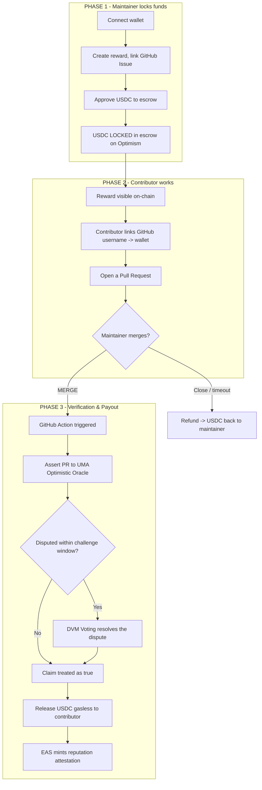
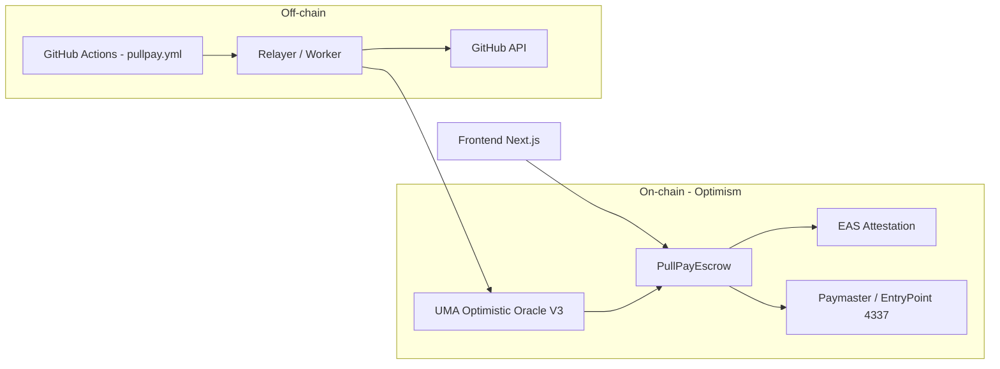

<p align="center">
  <h1 align="center">PullPay</h1>
  <p align="center">
    <strong>Trust-minimized open source rewards on Optimism.</strong><br>
    Merge the PR, the contributor gets paid in USDC — verified without an intermediary, settled without gas, and recorded as on-chain reputation.
  </p>
</p>

<p align="center">
  
  
  
  
  
</p>

## The Problem & Vision

The open source ecosystem runs on hundreds of small contributions (bug fixes, docs, translations, tooling). But paying a $5–20 reward is surprisingly hard: fees eat the reward, manual payouts are a hassle, and contributors have no guarantee they will actually get paid.

**PullPay** solves this with an **on-chain escrow + GitHub automation**. A maintainer locks USDC in a smart contract and adds a single workflow file to their repo. When a Pull Request (PR) is merged and verified, USDC is automatically paid to the contributor.

What makes PullPay different?

- **Decentralized Verification (UMA):** We don't just rely on a centralized bot to check `merged == true`. Anyone can dispute a payout if the PR quality is poor.
- **On-Chain Reputation (EAS):** Every paid contribution mints an attestation, creating a portable, verifiable developer CV.
- **Gasless Claims (ERC-4337):** Contributors don't need ETH. The USDC just arrives.

## How It Works



## 🏗️ Architecture

The system is built to be trust-minimized and reliable, utilizing the best of the Optimism ecosystem.



## Repository Layout

```text
contracts/               Foundry project — PullPayEscrow & WhitelistEM (Solidity)
frontend/                Next.js App Router — Web UI, dashboard, and relayer API
docs/                    Product Requirements Document (PRD) and Planning notes
```

## Quickstart

**1. Smart Contracts**

```bash
cd contracts
forge install
forge test
```

**2. Frontend & Relayer**

```bash
cd frontend
npm install
npm run dev
```

*Note: Ensure you have your environment variables set up for the RPC endpoints, UMA addresses, and EAS schema UID.*
