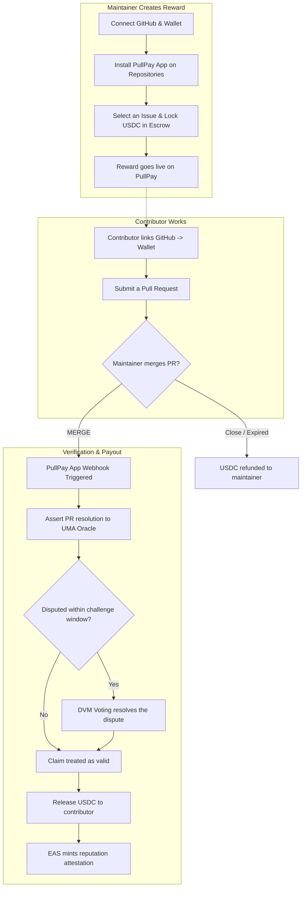
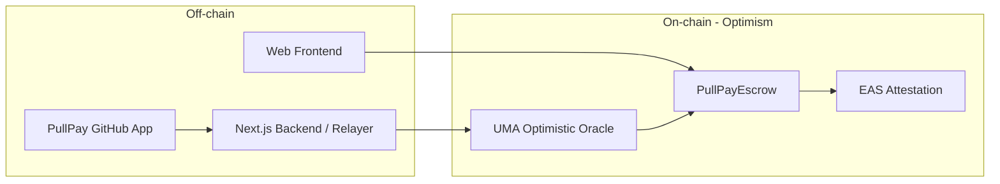

<p align="center">
  <h1 align="center">PullPay</h1>
  <p align="center">
    <strong>Trust-minimized open-source rewards on Optimism.</strong><br>
    Merge the PR, the contributor gets paid in USDC — verified without an intermediary, settled securely, and recorded as on-chain reputation.
  </p>
</p>

<p align="center">
  
  
  
  
  
</p>

## The Problem & Vision

The open-source ecosystem runs on hundreds of small contributions (bug fixes, docs, translations, tooling). But paying out small bounties ($5–20) is surprisingly hard: transaction fees eat the reward, manual payouts are a hassle for maintainers, and contributors have no guarantee they will actually get paid.

**PullPay** solves this with an **on-chain escrow + GitHub App integration**. A maintainer locks USDC in a smart contract and selects an open issue via the PullPay platform. When a contributor merges a Pull Request (PR) resolving that issue, USDC is automatically unlocked and paid to them.

What makes PullPay different?

- **Seamless GitHub Integration:** Install the PullPay GitHub App once. We automatically track merged PRs and manage the settlement securely.
- **Decentralized Verification (UMA):** We don't just blindly trust a centralized server. The payout is asserted to the UMA Optimistic Oracle, meaning anyone can dispute a payout if the PR quality is malicious or invalid.
- **On-Chain Reputation (EAS):** Every paid contribution mints an Ethereum Attestation Service (EAS) record, creating a portable, verifiable, and permanent developer CV.

## How It Works



## Core Features

1. **GitHub App Native:** No need to manually add `.yml` files to every repository. Just install the PullPay GitHub App and select which repositories to enable for bounties.
2. **Trustless Escrow:** Funds are securely locked in an audited smart contract on Optimism. Maintainers cannot simply walk away with the money after the work is done, and contributors cannot drain funds with spam PRs due to the UMA challenge window.
3. **Automated Settlement:** The system listens for GitHub Webhooks and proposes the settlement on-chain automatically.
4. **Reputation Building:** Get recognized for your open-source work. Each successful bounty yields an EAS attestation tied to your wallet address.

## Architecture

The system is built to be trust-minimized and reliable, utilizing the best of the Optimism ecosystem.



## Repository Layout

```text
contracts/               Foundry project — Smart contracts including PullPayEscrow (Solidity)
frontend/                Next.js App Router — Web UI, dashboard, API routes, and GitHub Webhooks
docs/                    Product documentation and planning notes
```

## Quickstart

**1. Smart Contracts**

```bash
cd contracts
forge install
forge build
forge test
```

**2. Frontend & Relayer**

Ensure you have your environment variables set up in `frontend/.env.local` for the RPC endpoints, UMA addresses, GitHub App credentials, and EAS schema UID.

```bash
cd frontend
npm install
npm run dev
```

*Note: You must have a configured GitHub App with Webhook access to fully run the local development server.*
