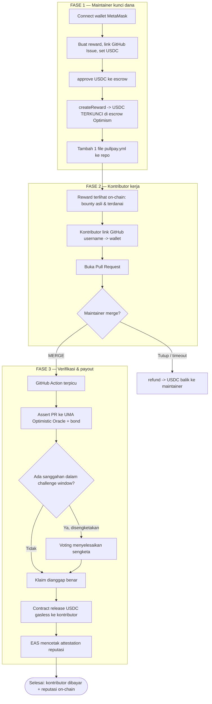

<aside>
🎯

**One-liner:** Merge PR-nya, kontributor langsung dibayar USDC — diverifikasi tanpa perantara, dicairkan tanpa gas, dan dicatat sebagai reputasi on-chain. **Reward open source yang *trust-minimized*, di Optimism**

</aside>

## 1. Vision & masalah

Ekosistem open source bergantung pada ratusan kontribusi kecil (bug fix, docs, translasi, tooling). Tapi reward $5–20 sering tidak ekonomis: fee Stripe/PayPal/bank memakan porsi besar, dan koordinasi payout manual (Discord, spreadsheet, DM) lebih mahal daripada reward-nya. Akibatnya banyak kontribusi berharga tidak pernah dihargai.

**Solusi:** escrow on-chain + otomatisasi GitHub. Maintainer mengunci USDC di smart contract, menambahkan 1 file workflow, dan pembayaran keluar otomatis saat PR di-merge & terverifikasi.

## 2. Lanskap kompetitor (ide ini SUDAH ada)

Jujur: konsep "merge PR → bayar otomatis" bukan hal baru. Yang sudah ada:

| Proyek | Chain | Catatan |
| --- | --- | --- |
| Octasol | Solana | Escrow, PR merged → bayar, refund kalau ditolak |
| Collaborators.build | On-chain USDC | Bot lacak merge → rilis USDC |
| boss.dev / boss-bounty | — | Bounty dari teks issue, bayar saat issue ditutup |
| Opire | — | Platform bounty issue populer |
| Gitpay | — | Fund issue, reward PR merged |
| tea.xyz | OP Stack L2 | L2 khusus reward OSS |
| PullPay (referensi) | Stellar/Soroban | 1 file `pullpay.yml`, oracle Cloudflare Worker |

**Kelemahan umum SEMUA kompetitor:** verifikasi bergantung pada **bot/server terpusat**, dan hanya cek `merged == true` (merge ≠ kerja berkualitas). Inilah celah yang kita serang.

## 3. Ide diferensiasi (bikin unik)

### ⭐ Wedge utama — Verifikasi terdesentralisasi + lapisan sengketa (UMA)

Ganti Cloudflare Worker terpusat dengan **UMA Optimistic Oracle**. Pernyataan *"PR #123 di-merge DAN benar-benar menyelesaikan issue sesuai kriteria"* di-assert dengan bond + challenge window. Siapa pun (maintainer lain, kontributor, sponsor) bisa menyanggah kalau merge-nya curang atau kerjanya tidak beres → sengketa diselesaikan lewat voting, bukan satu server. **Ini pembeda paling tajam:** kita pindah dari "apakah PR merged?" ke "apakah PR ini benar layak dibayar?".

### ⭐ Reputasi on-chain via EAS (Ethereum Attestation Service)

Setiap reward yang settle mencetak **attestation** di Optimism yang mencatat: repo, jenis kontribusi, nilai, tanggal. Hasilnya **CV developer yang portabel, verifiable, dan tidak bisa dipalsukan** — bisa dipakai lintas platform. Sangat Optimism/Superchain-native (EAS besar di OP & Base).

### ⭐ Klaim gasless untuk kontributor (Account Abstraction / ERC-4337 + paymaster)

Kontributor **tidak perlu punya ETH** untuk klaim. Paymaster mensponsori gas (bisa dipotong dari reward). Ini menghapus friksi terbesar untuk onboarding developer non-crypto — mereka merge PR, lalu USDC "muncul" tanpa perlu tahu soal gas.

### Auto-split multi-kontributor

Banyak PR punya co-author. Contract bisa **membagi reward otomatis** berdasarkan co-author trailer / kontribusi commit. Ini masalah nyata yang belum dipecahkan kompetitor (disebut eksplisit di diskusi GitHub Sponsors).

### (Roadmap) Pool RetroPGF-style

Pendanaan retroaktif ala Optimism: sponsor mengisi **pool per-repo**, lalu didistribusikan ke kontribusi yang sudah merged berdasarkan dampak. Sejalan langsung dengan etos Retroactive Public Goods Funding milik Optimism → cerita yang kuat untuk juri OP.

### (Opsional) Escrow yield

USDC yang terkunci menghasilkan yield (mis. Aave di Optimism) selama menunggu → mendanai gas/protokol tanpa memungut fee dari kontributor.

<aside>
🏆

**Positioning untuk juri:** Jangan jual "reward PR otomatis" (sudah ada). Jual **"infrastruktur reward OSS yang trust-minimized: verifikasi terdesentralisasi + reputasi portabel + gasless"** — kombinasi yang tidak dimiliki kompetitor mana pun.

</aside>

## 4. Arsitektur (versi Optimism)

## 5. Tech stack

- **Smart contract:** Solidity + Foundry/Hardhat; deploy ke **Optimism Sepolia** (demo) / OP Mainnet (produksi)
- **Aset:** USDC (ERC-20) di Optimism; pola `approve` + `transferFrom`
- **Verifikasi:** UMA Optimistic Oracle V3 (`assertTruth`) + escalation manager
- **Reputasi:** Ethereum Attestation Service (EAS) di Optimism
- **Gasless:** ERC-4337 (bundler + paymaster)
- **Otomatisasi:** GitHub Actions (`pullpay.yml`) + relayer/worker sebagai proposer assertion
- **Frontend:** Next.js + **RainbowKit + wagmi v2 + viem** (+ `@tanstack/react-query`); wallet MetaMask

## 6. Scope hackathon vs roadmap

### MVP (target 2–3 hari)

- [ ]  `PullPayEscrow` contract: `createReward` / `release` / `refund`
- [ ]  Integrasi UMA OOv3 dengan **liveness pendek** (30–120 dtk) agar demo cepat, atau sandbox oracle
- [ ]  `pullpay.yml` + worker minimal (assert ke UMA saat merge)
- [ ]  Frontend: create reward (dengan `approve`) + dashboard status on-chain
- [ ]  1 EAS attestation saat settle (versi sederhana)
- [ ]  Deploy di Optimism Sepolia
- [ ]  **Demo end-to-end:** buat reward → buka PR di repo demo → merge → (challenge window) → USDC masuk → attestation tercetak

### Roadmap (slide)

- Gasless penuh (paymaster produksi)
- Auto-split multi-kontributor
- Mode Timelock 24 jam + UI sengketa
- Pool RetroPGF-style per-repo
- Escrow yield (Aave)
- Dukungan GitLab/Gitea

## 7. Ekonomi & gas

- Optimism: interaksi contract umumnya **beberapa sen** (transfer ERC-20 bisa < $0.000001 saat sepi). Erosi < 1% pada reward $5–20 — jauh di bawah Stripe (36% pada $5) atau Ethereum L1 ($15+ gas).
- Fee = L2 execution (murah) + L1 data fee (fluktuatif, turun drastis pasca EIP-4844/blob).
- Demo pakai testnet → gas gratis.

## 8. Risiko & mitigasi

| Risiko | Mitigasi |
| --- | --- |
| Ide sudah ramai | Diferensiasi via UMA + EAS + gasless (bukan sekadar "bayar saat merge") |
| Resolusi UMA lambat (hari) untuk demo | Liveness pendek / sandbox oracle saat demo; jelaskan versi mainnet di slide |
| Self-merge / sybil (maintainer bayar alt sendiri) | Bond + sengketa UMA; batas per-reward di contract |
| Kontributor tak punya ETH | Klaim gasless (paymaster) |
| Scope overrun | Kunci 1 alur end-to-end; sisanya jadi roadmap |

## 9. Pitch (30 detik)

> "Reward PR otomatis sudah ada di mana-mana — tapi semuanya percaya pada satu server dan cuma cek 'apakah di-merge'. PullPay di Optimism memverifikasi kelayakan reward secara **terdesentralisasi lewat UMA**, membayar kontributor **tanpa mereka perlu punya ETH**, dan mencetak **reputasi on-chain** yang portabel. Zero setup untuk maintainer, trust-minimized untuk semua."
> 

## 10. Siapa yang bisa protes (dispute) & perlindungan contributor

Bedakan dulu dua peran yang sering tercampur:

- **Disputer (yang protes):** mengangkat "ini salah".
- **Hakim / arbiter (yang memutuskan):** menentukan siapa yang benar saat ada selisih. **Peran netral inilah** alasan sebenarnya UMA dipakai — bukan supaya ada orang iseng protes.

Kita tetap memakai **hakim netral (UMA)** bahkan untuk reward dari kantong maintainer sendiri, khusus untuk **melindungi contributor**.

### Ya, contributor bisa protes

Ada **dua arah kegagalan**, dan sistem harus adil untuk keduanya:

| Mode gagal | Yang dirugikan | Yang protes | Melindungi |
| --- | --- | --- | --- |
| Bayar untuk kerja palsu / tidak layak | Pemberi dana | Maintainer / sponsor / watchdog | Pemberi dana |
| Kerja sudah sesuai tapi tak dibayar | Contributor | **Contributor sendiri (klaim mandiri)** | Contributor |

Jadi kalau pekerjaan sudah sesuai kriteria & PR merged tapi tidak dibayar (relayer mati, maintainer mengulur), **contributor bisa mengajukan klaim sendiri** ("PR #X sudah merged & sesuai kriteria — bayar saya"), memasang bond, lalu kalau maintainer tidak setuju dia yang harus dispute → diputuskan **hakim netral**. Bond dikembalikan kalau klaimnya jujur, jadi contributor yang jujur **tidak keluar biaya bersih**. Ini menghapus ketergantungan contributor pada niat baik maintainer.

<aside>
⚖️

**Kesimpulan desain:** "membatasi siapa yang boleh protes" ≠ "menghapus kebutuhan hakim netral". UMA dipertahankan sebagai **hakim yang tidak berpihak** — melindungi pemberi dana dari kerja palsu, sekaligus melindungi contributor dari pembayaran yang ditahan.

</aside>

## 11. Instant vs Safeguarded — UMA sebagai jaring pengaman (bukan wajib)

UMA **tidak selalu nyala**. Kalau maintainer mendanai dari kantong sendiri **dan** dia yang meng-approve (merge), maka **merge = persetujuan = bayar langsung** — tanpa oracle. UMA baru aktif sebagai *fallback*.

| Situasi | Mode | Pakai UMA? |
| --- | --- | --- |
| Danai sendiri **& approve/merge** | Instant | Tidak — bayar langsung |
| Maintainer diam / mengulur, kerja sudah sesuai | Instant → eskalasi | Ya — contributor klaim mandiri |
| Dana dari pool / sponsor (pembayar ≠ pemutus) | Safeguarded | Ya |
| Ada yang menyanggah | Safeguarded | Ya |

Default-nya jadi super simpel: **merge → USDC cair**. UMA berfungsi sebagai jaring pengaman yang baru aktif kalau (a) maintainer tidak bertindak sampai lewat *grace deadline* (contributor bisa eskalasi sendiri), (b) dananya milik bersama, atau (c) ada sanggahan.

<aside>
💡

Pitch-nya bergeser jadi lebih matang: **"jalur cepat untuk yang saling percaya, jaring pengaman terdesentralisasi saat kepercayaan itu tidak ada."** Implementasi lengkap + flow ada di PRD §24 (Verification Tiers).

</aside>

## 12. Bukti dana (Proof of Funding) — contributor bisa cek sendiri

Contributor tidak boleh mengerjakan bounty yang ternyata kosong. Karena escrow-nya **on-chain**, status “terdanai” bisa **diverifikasi publik & mandiri** — tidak perlu percaya UI PullPay maupun kata-kata maintainer.

Saat `createReward`, USDC ditarik ke escrow dan reward disimpan `status = Funded`, menghasilkan 3 jejak permanen & publik: event `RewardCreated`, event `Transfer` USDC ke alamat escrow, dan state `rewards[id]` yang bisa dibaca siapa pun.

| Cara cek | Bagaimana | Tingkat kepercayaan |
| --- | --- | --- |
| Di UI PullPay | Badge “✅ Funded — $20 USDC locked” + link ke tx | Praktis |
| Block explorer | Buka escrow di Optimistic Etherscan → lihat tx `RewardCreated`  • transfer USDC masuk | Trustless |
| Baca contract langsung | Panggil view `getReward(id)` / `isFunded(id)` via RPC/cast | Trustless |
| Di issue GitHub | GitHub App komentar “💰 $20 USDC funded · verify on-chain → link” | Praktis |

**Anti-spoofing:** `rewardId = keccak256(repo, issueNumber, nonce)` mengikat dana ke satu repo+issue tertentu, jadi contributor bisa menghitung ulang `id` dari issue-nya dan mencocokkannya 1:1 dengan bukti on-chain. Bounty Board (§27 PRD) pun hanya menampilkan reward berstatus `Funded`.

<aside>
🔍

Detail lengkap (helper `getReward`/`isFunded`/`isSolvent` + fitur F11 Proof of Funding) ada di PRD §28.

</aside>

## 13. Pilihan framework frontend — React atau Next.js?

**Rekomendasi: Next.js 16 (App Router) — versi stable terbaru (16.2.x, React 19.2); scaffold via `npx create-next-app@latest`.** React biasa (Vite) memang lebih simpel, tapi PullPay butuh hal-hal yang bikin Next.js lebih unggul:

1. **SEO Bounty Board** — bounty publik harus ke-index Google → mesin discovery. React SPA lemah di sini; Next.js kasih SSR/ISR.
2. **Endpoint relayer/webhook GitHub** — pakai Route Handlers (`app/api`) tanpa backend terpisah.
3. **Secret aman** — kunci RPC/relayer tetap di server, tidak bocor ke client.
4. **Load awal ringan** — React Server Components + streaming (bundle JS lebih kecil).
5. **Deploy 1 klik** di Vercel + optimasi font/image bawaan.

React SPA murni hanya cocok untuk app internal tanpa SEO & yang sudah punya backend sendiri — bukan kasus kita.

<aside>
🧱

Best practice lengkap + contoh wiring (Providers, wagmi `ssr:true` + `cookieStorage`, strategi render per-layar) ada di PRD §29.

</aside>

## 14. Design system (mau tampil seperti apa)

**Prinsip:** *precise, editorial, engineered* — terkesan dibuat tim desain developer-tools (Linear / Vercel / Stripe / Rainbow), **bukan template AI**. Dark-first, whitespace lega, border tipis 1px, angka on-chain selalu monospace.

### 14.1 Token warna

| Token | Nilai | Pakai untuk |
| --- | --- | --- |
| Base (dark) | `#0B0B0C` | Background utama (bukan hitam murni) |
| Surface | `#141416` | Kartu / panel |
| Border hairline | `rgba(255,255,255,0.08)` | Garis pemisah 1px |
| Paper (light) | `#FAFAF8` / ink `#16161A` | Tema terang (opsional) |
| Aksen | Optimism red `#FF0420` | 1 aksi utama per layar (hemat, bukan gradient) |
| Sinyal | green `#3FB950` · amber `#D29922` · red `#F85149` | Status: Funded/Paid · Verifying · Disputed |

### 14.2 Tipografi

- **UI + heading:** grotesque modern — **Geist** (alt: Söhne, Neue Haas Grotesk). Heading besar, letter-spacing rapat; eyebrow uppercase 11–12px.
- **Data on-chain** (alamat wallet, jumlah USDC, tx hash, rewardId): **monospace** — Geist Mono / IBM Plex Mono, aktifkan tabular numbers (`tnum`).
- Uang selalu monospace + chip mata uang kecil.

### 14.3 Bentuk, spacing & komponen

- **Radius:** 8–10px kartu, 6px input/tombol (hindari serba-pill).
- **Spacing:** skala 4px (4/8/12/16/24/40).
- **Status:** pill badge + titik 6px berwarna.
- **Tombol:** solid aksen untuk primary (1 per view), sisanya ghost/outline. Ikon garis **Lucide / Phosphor** (1 set saja).
- **Layout:** left-aligned, asimetris, grid editorial, data-dense ala Linear.

### 14.4 Motion (tenang, 150–250ms ease-out)

Count-up angka statistik · marquee repo yang lagi didanai · fade/blur-up saat reveal · magnet hover-lift di tombol primary. Tidak bouncy, tidak flashy.

### 14.5 Larangan (biar tak terkesan AI)

Tanpa gradient ungu/biru, tanpa glassmorphism/blur panel, tanpa neon glow, tanpa emoji sebagai ikon, tanpa ilustrasi 3D generik, tanpa “Inter di mana-mana + serba center”.

### 14.6 Implementasi

**Tailwind CSS + shadcn/ui** untuk komponen dasar, **reactbits.dev** (secukupnya) untuk motion. Font via `next/font` (Geist sudah bawaan Next.js).

<aside>
🎨

Spesifikasi penuh + prompt siap-tempel untuk generate UI (Google Stitch), pemetaan komponen reactbits, dan rekomendasi font/aset ada di halaman PullPay — Stitch UI Prompt.

</aside>